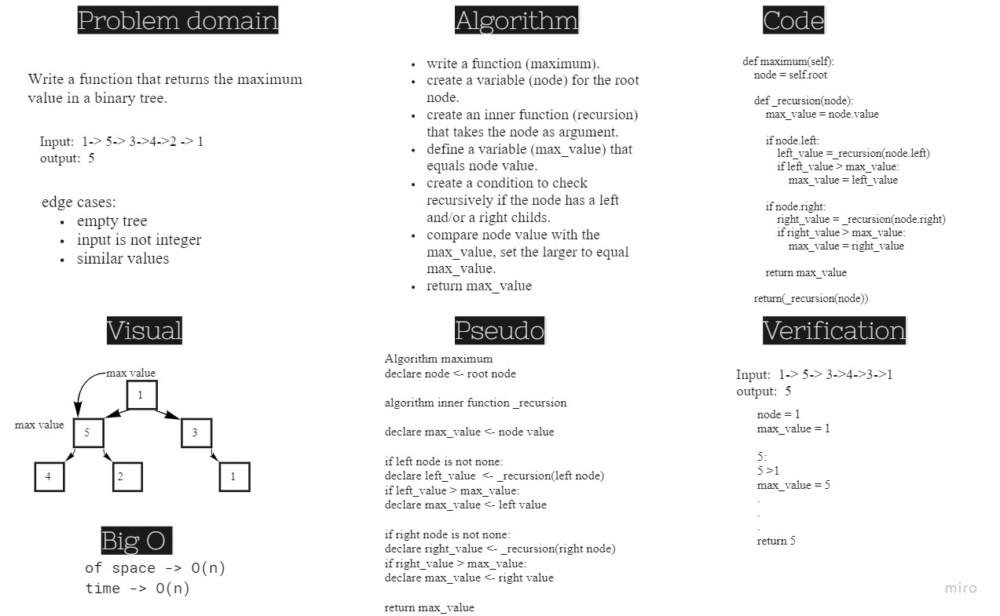

# Challenge Summary
Write the following method for the Binary Tree class:
- find maximum value
- Arguments: none
- Returns: number
- Find the maximum value stored in the tree. You can assume that the values stored in the Binary Tree will be numeric.

## Whiteboard Process

## Approach & Efficiency
Big O time notaion of maximum() method is -> O(n)
Big O space notaion of maximum() method is -> O(n)

## Solution
[Link to code](./Trees/trees.py)

[Link to tests](./tests/test_trees.py) 
