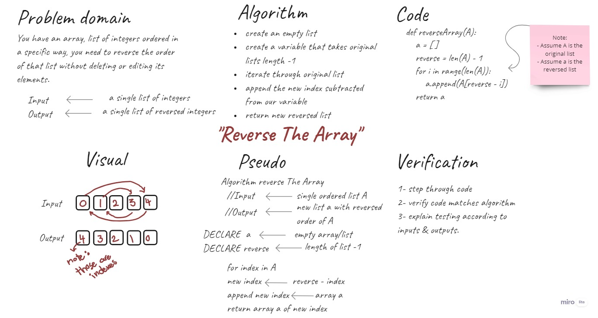

# Reverse an array
**Requirements** 

Write a function called reverseArray which takes an array as an argument. Without utilizing any of the built-in methods available to your language, return an array with elements in reversed order.

## Big O
for **time** --> O(n)
for **space** --> O(n)

## Whiteboard process
