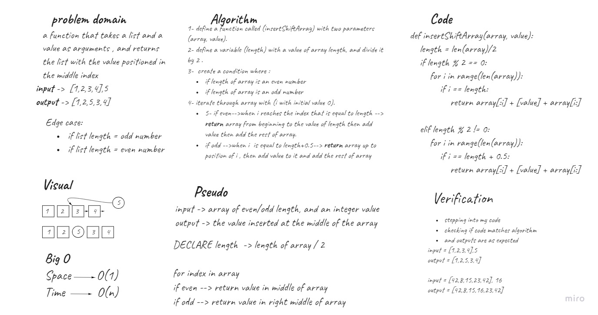

# Insert to Middle of an Array
**Requirements** 

Write a function called insertShiftArray which takes in an array and a value to be added. Without utilizing any of the built-in methods available to your language, return an array with the new value added at the middle index.

## Whiteboard process

## Approach & Efficiency
here big O of space is (1) because there is one variable being stored : length
and for big O of time it is O(n) because it is the worst case here as the for loop through an array gives (n) times 