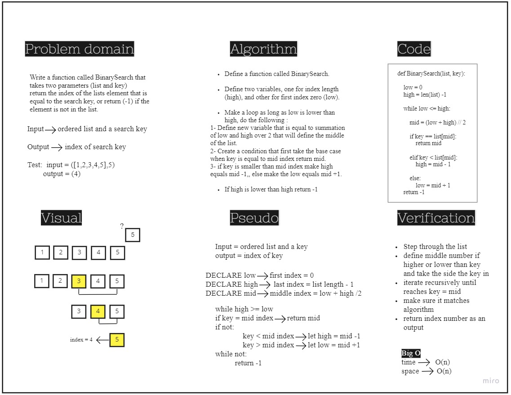

# Binary search in a sorted 1D array
**Requirements** 

Write a function called BinarySearch which takes in 2 parameters: a sorted array and the search key. Without utilizing any of the built-in methods available to your language, return the index of the array’s element that is equal to the value of the search key, or -1 if the element is not in the array.

## Whiteboard process

## Approach & Efficiency
here big O of space is (n) because there is a recursive section where all elements of array are held and stored permenantly in the stack.
and for big O of time it is O(n) because it is the worst case here as the for loop through an array gives (n) times 