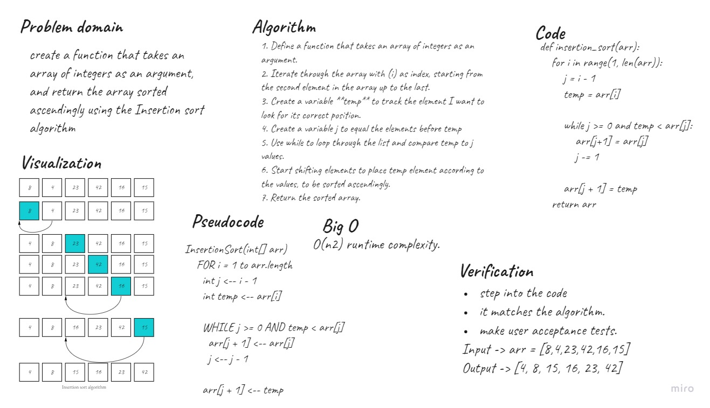

# Challenge Summary
create a function that takes an array of integers as an argument,
and return the array sorted ascendingly using the Insertion sort algorithm.

> trace the algorithm by stepping through the process with the provided sample array. Document your explanation by creating a blog article that shows the step-by-step output after each iteration through some sort of visual.

## Whiteboard Process

## Approach & Efficiency
You can clearly notice that the code has two nested loops: For loop and While loop, each loop has a time complexity O(n).

- The best case scenario happens if we had an already sorted array, that will prevent the inner loop form execution and then the runtime complexity will be O(n).

- The worst case scenario is happens if we had a descending ordered array which will make n executions of the inner loop, and that will give us a runtime complexity of O(n²).

- And that makes the Big O time complexity of insertion sort function is **O(n²)**

## Solution
The Article link
[here](https://dialabk.hashnode.dev/insertion-sort-algorithm)