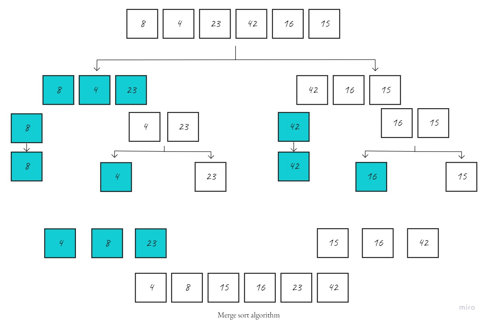

# Challenge Summary
trace the algorithm of Merge Sort by stepping through the process with the provided sample array. Document your explanation by creating a blog article that shows the step-by-step output after each iteration through some sort of visual.

Once you are done with your article, code a working, tested implementation of Merge Sort based on the pseudocode provided.

## Whiteboard Process

## Approach & Efficiency
- Merge function takes a linear time to merge the two arrays which is O(n).
- While the Merge_sort function takes a logarithmic runtime as it calls itself (recursively) to divide the array into half in each step, which is O(log n).

Hence the total time for merge_sort function will become n(log n), which gives us a time complexity of **O(n*log n)** and this is the best worst case scenario for time complexity.

- Big O space complexity of merge sort method is **O(n)**

## Solution
[Blog](https://dialabk.hashnode.dev/merge-sort-algorithm)
