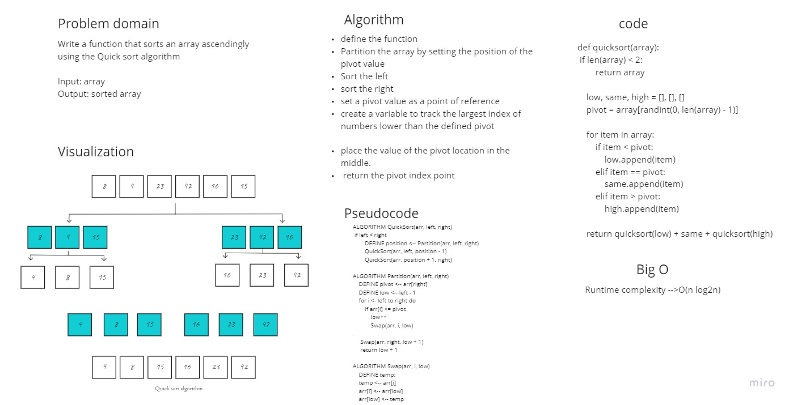

# Challenge Summary
trace the algorithm of Merge Sort by stepping through the process with the provided sample array. Document your explanation by creating a blog article that shows the step-by-step output after each iteration through some sort of visual.

Once you are done with your article, code a working, tested implementation of Quick Sort based on the pseudocode provided.

## Whiteboard Process

## Approach & Efficiency
In Quick sort the input list is partitioned in linear time, O(n), and this process repeats recursively an average of log2n times. This leads to a final complexity of O(n log2n).

## Solution
[Blog](https://dialabk.hashnode.dev/quick-sort-algorithm)
