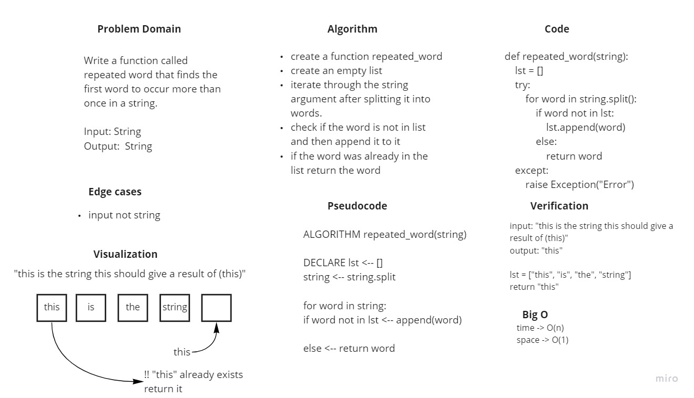

# Challenge Summary
Write a function called repeated word that finds the first word to occur more than once in a string.
- Arguments: string
- Return: string

## Whiteboard Process

## Approach & Efficiency
- Big O time complextiry of repeated_word function is O(n) because we iterate through the n size of string.
- Big O space complexity of repeated_word function is O(1) because each time the function gets excuted it will give the same word from the string.

## Solution
- [Link to code](./repeated_word/repeated_word.py)

- [Link to tests](./tests/test_repeated_word.py)