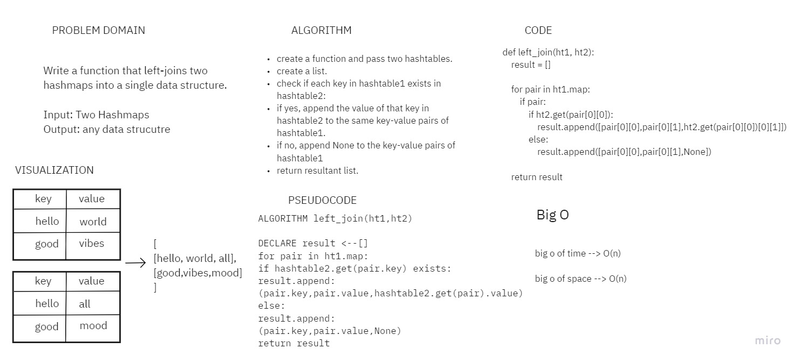

# Challenge Summary
Write a function that LEFT JOINs two hashmaps into a single data structure.

## Whiteboard Process

## Approach & Efficiency
Big O time complexity --> O(n)
Big O space complexity --> O(n)

## Solution
[Link to code](./left_join_hashmap/left_join_hashmap.py)