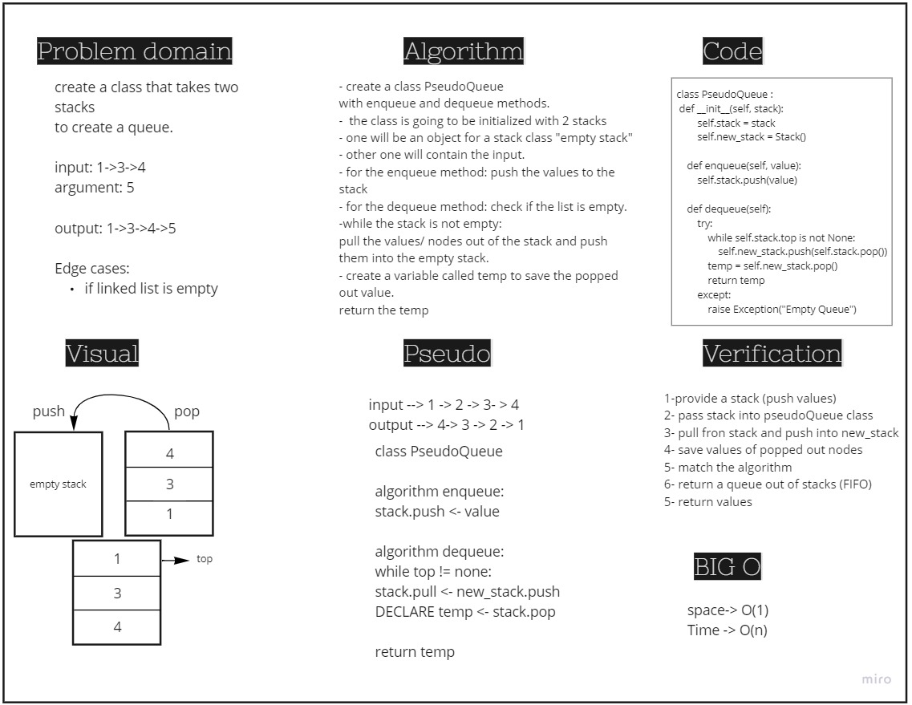

# Challenge Summary
Create a new class called pseudo queue.
Internally, utilize 2 Stack instances to create and manage the queue.
Methods:
- enqueue --> Inserts value into the PseudoQueue, using a first-in, first-out approach.

- dequeue --> Extracts a value from the PseudoQueue, using a first-in, first-out approach.

## Whiteboard Process

## Approach & Efficiency
enqueue()--> time complexity O(1)
         --> space complexity O(1)

dequeue() --> time complexity O(n)
         --> space complexity O(1)

## Solution
[Code Link](./stack_and_queue/stack_queue_pseudo.py)