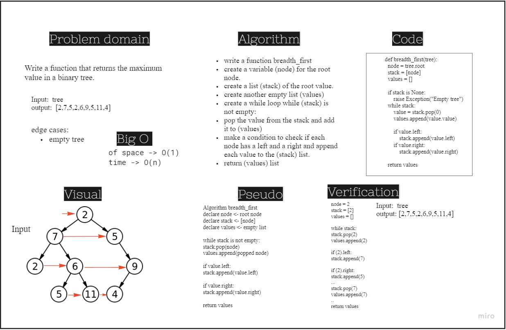

# Challenge Summary
Write a function called breadth first
- Arguments: tree
- Return: list of all values in the tree, in the order they were encountered
- NOTE: Traverse the input tree using a Breadth-first approach

## Whiteboard Process

## Approach & Efficiency
Big O of space for Breadth_first method is O(1)
Big O of time for Breadth_firt method is O(n)

## Solution
[Link to code](./trees/breadth_first.py)
[Link to test](./tests/test_trees.py)