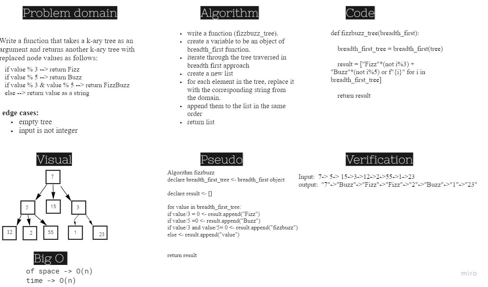

# Challenge Summary
Write a function called fizz buzz tree
- Arguments: k-ary tree
- Return: new k-ary tree
- Determine whether or not the value of each node is divisible by 3, 5 or both. - Create a new tree with the same structure as the original, but the values  modified as follows:

1. If the value is divisible by 3, replace the value with “Fizz”
2. If the value is divisible by 5, replace the value with “Buzz”
3. If the value is divisible by 3 and 5, replace the value with “FizzBuzz”
4. If the value is not divisible by 3 or 5, simply turn the number into a String.

## Whiteboard Process

## Approach & Efficiency
Big O of space for fizzbuzz_tree function is O(1)
Big O of time for fizzbuzz_tree function is O(n)

## Solution
[Link to code](./fizzbuzz.py)
[Link to tests](./tests/test_fizzbuzz.py)