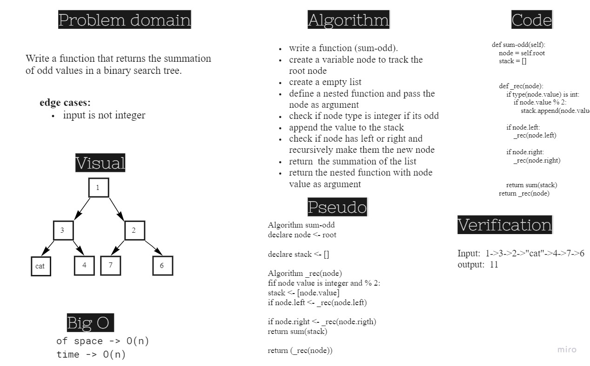

# Challenge Summary
Write a function that returns the summation of odd numbers in a binary search tree

## Whiteboard Process

## Approach & Efficiency
Big O of space for odd_sum function is O(n)
Big O of time for odd_sum function is O(n)

## Solution
[Link to code](./trees/odd_summation.py)
