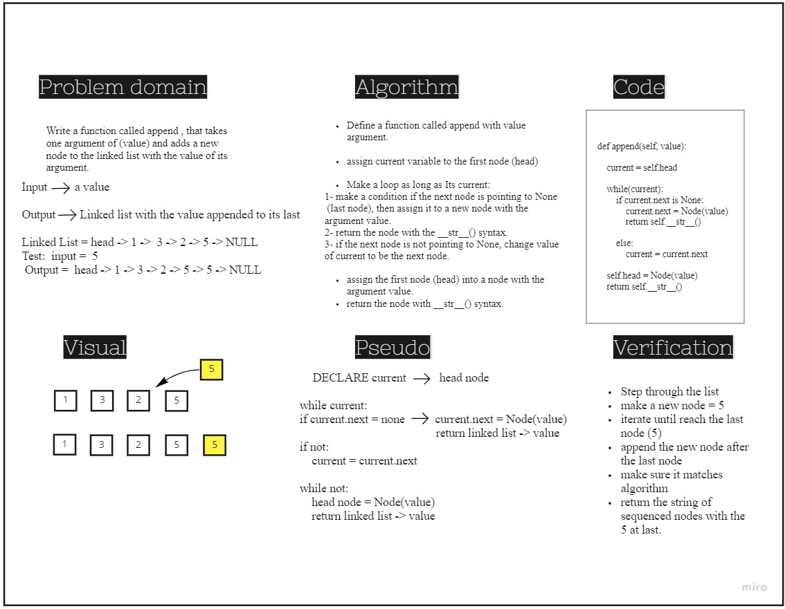
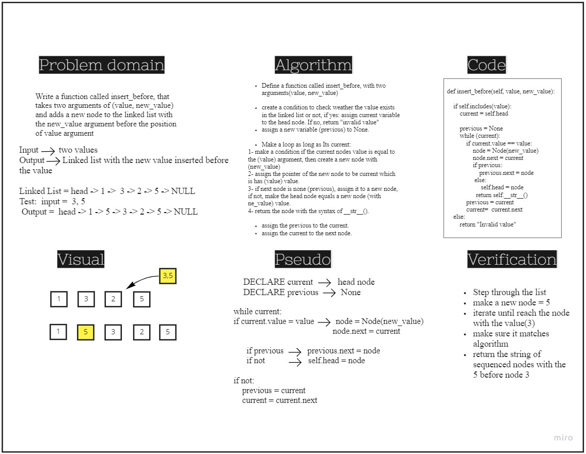
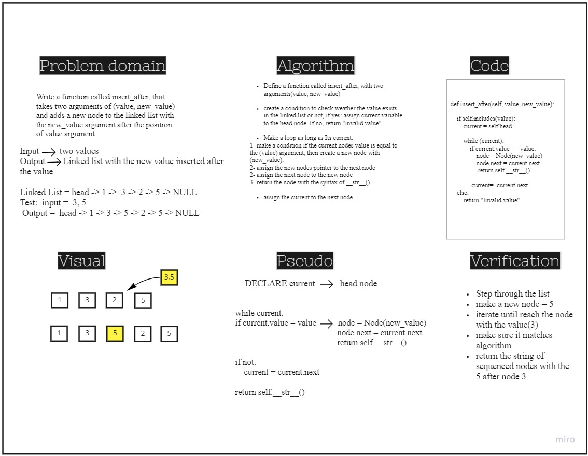
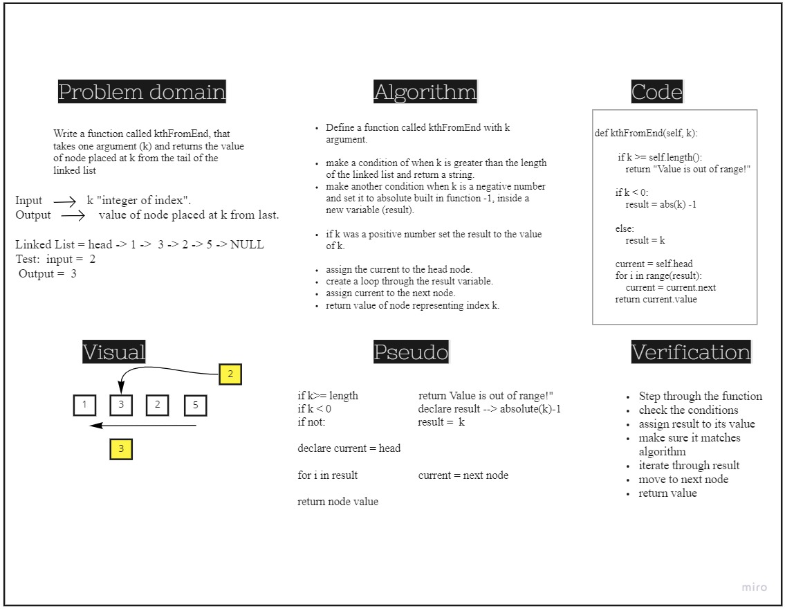
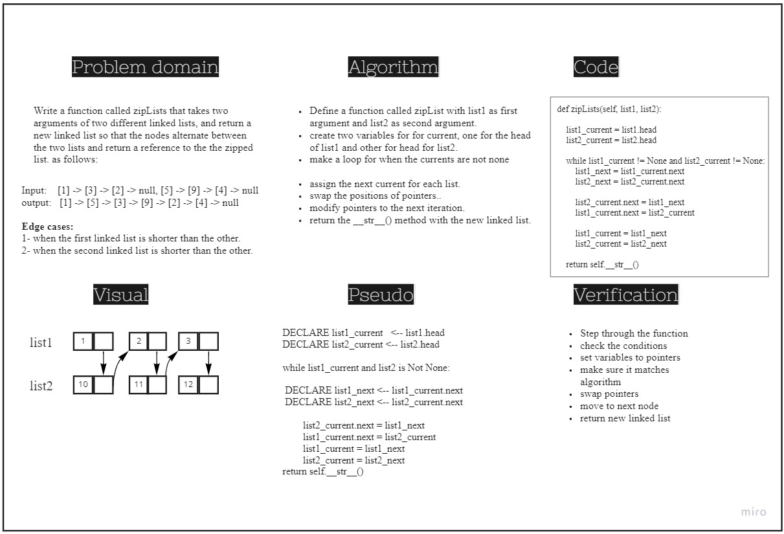

# Implementation: Singly Linked Lists
A Linked list is a sequence of Nodes, each node(is devided into two parts) one contains data item and the other contains the reference (an address )of the next node.

# Singly linked lists
singly linked lists consist of nodes in which each node has only one adress(next) that points to the next node, each node contains also a value.

## Challenge
- Create a Node class that has properties for the value stored in the Node, and a pointer to the next Node.
- Create a Linked List class, include a head property, an empty Linked List should be created.


Testing: 
1. Can successfully instantiate an empty linked list
2. Can properly insert into the linked list
3. The head property will properly point to the first node in the linked list
4. Can properly insert multiple nodes into the linked list
5. Will return true when finding a value within the linked list that exists
6. Will return false when searching for a value in the linked list that does not exist
7. Can properly return a collection of all the values that exist in the linked list


## Approach & Efficiency
- The insert method have big O(1), because we add one node each time at the begining.
- The include method have O(n) because we used while loop to iterate through the list.
- The to_str method have O(n) because we used while loop to iterate through the list.

## API 
- insert method --> Adds a new node with that value to the head of the list with an O(1) Time performance.
- include method --> Indicates whether that value exists as a Node’s value somewhere within the list.
- to_string method --> Returns: a string representing all the values in the Linked List, formatted as:
```
"{ a } -> { b } -> { c } -> NULL"
```
__________________________________

# Append method

## Challenge Summary
**Append method: appends the argument value to the end of the linked list.**

## Whiteboard Process


## Approach & Efficiency
Time --> O(n)
space --> O(1)

_____________________________________________

# insert_before method

## Challenge Summary
**insert_before method -> adds a new node with the value immediately before the first node that has the value specified.**

## Whiteboard Process


## Approach & Efficiency
Time --> O(n)
space --> O(1)

_____________________________________________

# insert_after method

## Challenge Summary
**insert_after method -> adds a new node with the given new value immediately after the first node that has the value specified.**

## Whiteboard Process


## Approach & Efficiency
Time --> O(n)
space --> O(1)

_____________________________________________


# linked-list-kth method

## Challenge Summary
**khFromEnd method -> Return the node’s value that is k places from the tail of the linked list.**

## Whiteboard Process


## Approach & Efficiency
length() method :
Time --> O(n)
space --> O(1)

kthFromEnd() method:
Time --> O(n)
space --> O(1)

_____________________________________________


# zipLists method

## Challenge Summary
**zipLists method -> Zips the two linked lists together into one so that the nodes alternate between the two lists and return a reference to the the zipped list.**

## Whiteboard Process


## Approach & Efficiency
Time --> O(n)
space --> O(1)
